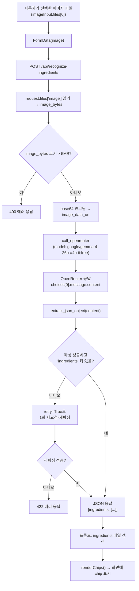
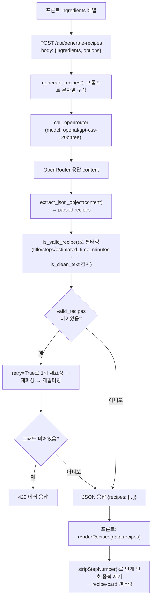
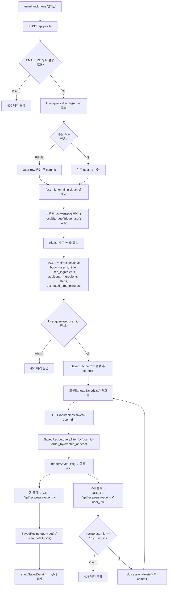

# 아키텍처 다이어그램

이 문서의 다이어그램은 `app.py`와 `templates/index.html`에 실제로 정의된 함수/라우트/DOM 이벤트 핸들러와, 코드에 실제로 존재하는 호출·요청 흐름만을 근거로 작성했습니다. 코드에 없는 호출은 그리지 않았습니다.

## 1. 함수/컴포넌트 관계도

```mermaid
flowchart TD
  subgraph FE["Frontend — templates/index.html (인라인 JS)"]
    direction TB

    EV_IMG_CHANGE["imageInput 'change' 핸들러"]
    EV_ADD_CLICK["addBtn 'click' 핸들러"]
    EV_RECOG_CLICK["recognizeBtn 'click' 핸들러"]
    EV_RECIPE_CLICK["recipeBtn 'click' 핸들러"]
    EV_PROFILE_CLICK["profileBtn 'click' 핸들러"]
    EV_LOGOUT_CLICK["logoutBtn 'click' 핸들러"]
    IIFE_RESTORE["IIFE: 로그인 상태 복원"]

    renderChips["renderChips()"]
    renderRecipes["renderRecipes(recipes)"]
    setLoggedInUI["setLoggedInUI(loggedIn)"]
    loadSavedList["loadSavedList()"]
    renderSavedList["renderSavedList(recipes)"]
    showSavedDetail["showSavedDetail(id)"]
    stripStepNumber["stripStepNumber(step)"]

    H_REMOVE["removeBtn 'click' (renderChips 내부에서 칩마다 생성)"]
    H_SAVE["saveBtn 'click' (renderRecipes 내부에서 카드마다 생성)"]
    H_DEL["delBtn 'click' (renderSavedList 내부에서 행마다 생성)"]
    H_TITLE["title 'click' (renderSavedList 내부에서 행마다 생성)"]

    renderChips -. 생성 .-> H_REMOVE
    H_REMOVE --> renderChips

    EV_ADD_CLICK --> renderChips
    EV_RECOG_CLICK --> renderChips

    EV_RECIPE_CLICK --> renderRecipes
    renderRecipes --> stripStepNumber
    renderRecipes -. 생성 .-> H_SAVE
    H_SAVE --> loadSavedList

    EV_PROFILE_CLICK --> setLoggedInUI
    EV_PROFILE_CLICK --> loadSavedList
    EV_LOGOUT_CLICK --> setLoggedInUI
    EV_LOGOUT_CLICK --> renderChips
    IIFE_RESTORE --> setLoggedInUI
    IIFE_RESTORE --> loadSavedList

    loadSavedList --> renderSavedList
    renderSavedList -. 생성 .-> H_DEL
    renderSavedList -. 생성 .-> H_TITLE
    H_DEL --> loadSavedList
    H_TITLE --> showSavedDetail
    showSavedDetail --> stripStepNumber
  end

  subgraph BE["Backend — app.py (Flask)"]
    direction TB

    index_route["index() · GET /"]
    profile_endpoint["profile_endpoint() · POST /api/profile"]
    save_recipe_endpoint["save_recipe_endpoint() · POST /api/recipes/save"]
    list_saved_recipes_endpoint["list_saved_recipes_endpoint() · GET /api/recipes/saved"]
    get_saved_recipe_endpoint["get_saved_recipe_endpoint() · GET /api/recipes/saved/&lt;id&gt;"]
    delete_saved_recipe_endpoint["delete_saved_recipe_endpoint() · DELETE /api/recipes/saved/&lt;id&gt;"]
    generate_recipes_endpoint["generate_recipes_endpoint() · POST /api/generate-recipes"]
    recognize_ingredients_endpoint["recognize_ingredients_endpoint() · POST /api/recognize-ingredients"]
    chat_route["chat() · POST /api/chat (프론트에서 호출 안 함)"]

    call_openrouter["call_openrouter(model, messages)"]
    extract_json_object["extract_json_object(text)"]
    recognize_ingredients_fn["recognize_ingredients(image_data_uri, retry)"]
    generate_recipes_fn["generate_recipes(ingredients, options, retry)"]
    is_valid_recipe["is_valid_recipe(recipe)"]
    is_clean_text["is_clean_text(text)"]

    UserModel[("User 테이블")]
    SavedRecipeModel[("SavedRecipe 테이블")]

    recognize_ingredients_endpoint --> recognize_ingredients_fn
    recognize_ingredients_endpoint --> extract_json_object
    recognize_ingredients_fn --> call_openrouter

    generate_recipes_endpoint --> generate_recipes_fn
    generate_recipes_endpoint --> extract_json_object
    generate_recipes_endpoint --> is_valid_recipe
    generate_recipes_fn --> call_openrouter
    is_valid_recipe --> is_clean_text

    profile_endpoint --> UserModel
    save_recipe_endpoint --> UserModel
    save_recipe_endpoint --> SavedRecipeModel
    list_saved_recipes_endpoint --> SavedRecipeModel
    get_saved_recipe_endpoint --> SavedRecipeModel
    delete_saved_recipe_endpoint --> SavedRecipeModel

    chat_route --> chat_direct_request["requests.post() 직접 호출"]
  end

  OpenRouterAPI[["OpenRouter API"]]
  call_openrouter --> OpenRouterAPI
  chat_direct_request --> OpenRouterAPI

  EV_RECOG_CLICK -->|"fetch POST"| recognize_ingredients_endpoint
  EV_RECIPE_CLICK -->|"fetch POST"| generate_recipes_endpoint
  EV_PROFILE_CLICK -->|"fetch POST"| profile_endpoint
  H_SAVE -->|"fetch POST"| save_recipe_endpoint
  loadSavedList -->|"fetch GET"| list_saved_recipes_endpoint
  H_DEL -->|"fetch DELETE"| delete_saved_recipe_endpoint
  showSavedDetail -->|"fetch GET"| get_saved_recipe_endpoint
```

## 2. 데이터 플로우

세 흐름을 잇는 코드가 없어서(서로 다른 진입점에서 시작), 하나로 억지로 합치지 않고 각각 독립된 다이어그램으로 나눴습니다.

### 2.1 재료 인식 흐름

### 2.2 레시피 생성 흐름

### 2.3 프로필 · 레시피 저장 흐름

